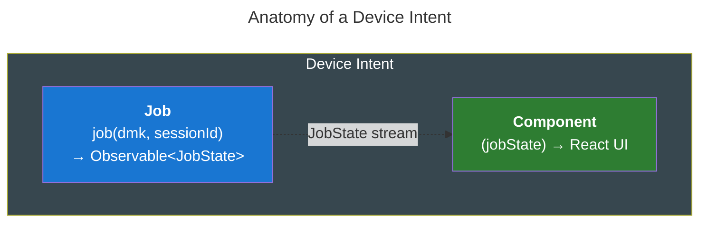
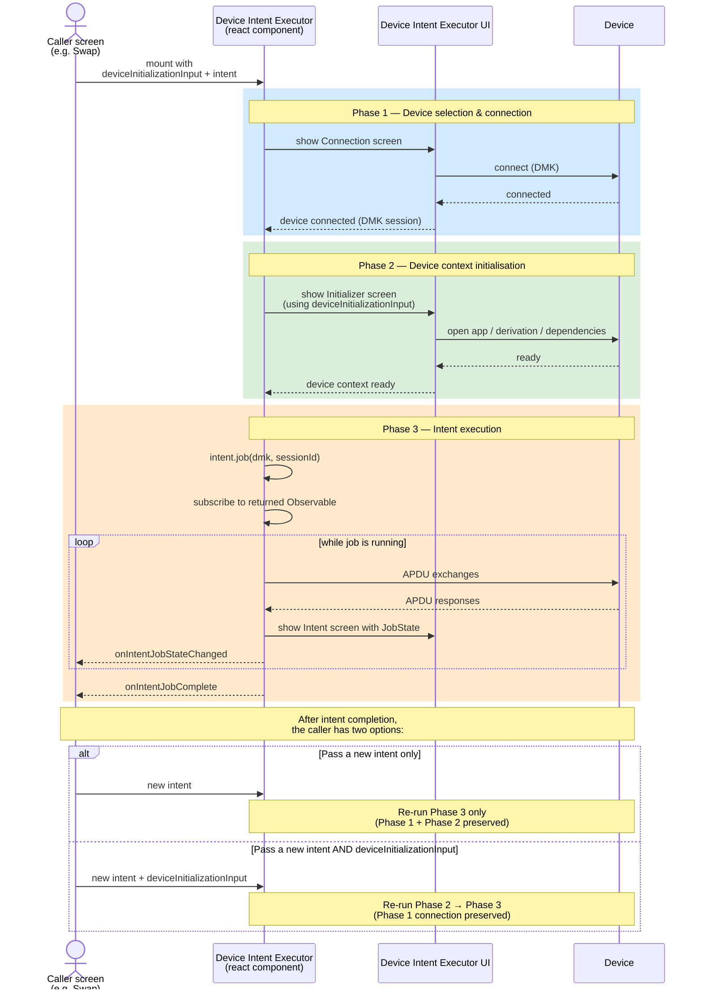

# @ledgerhq/device-intent

Shared types, helpers and the **Device Intent Executor** component for Ledger Wallet.

See the [ADR: Device Intent Executor component](https://ledgerhq.atlassian.net/wiki/spaces/WXP/pages/6852083917) for the full design rationale.

## Summary

### Who should read this

- **Wallet flow developers** integrating device interactions (sign, fetch address, broadcast, etc.) in LWM or LWD.
- **Engineers migrating** an existing flow from the legacy `connectApp` / `DeviceAction` patterns to DIE.
- **Coin module maintainers** wiring up new intents for additional coins or flows.
- **Maintainers of the executor itself** looking for the internal lifecycle, state machine, and orchestration contracts.

### What's covered

- **Concepts** — what a Device Intent is, what the Device Intent Executor (DIE) is, and how they fit together.
- **Usage guide** — mounting the executor, building the `deviceInitializationInput`, defining and structuring intents, orchestrating multi-step (and context-switching) flows.
- **Runtime contracts and observability** — completion, intent/context co-changes, cancellation, callbacks, interactive jobs, idle state.
- **Pitfalls and common mistakes** when integrating.
- **Internals** — three-layer architecture, XState lifecycle, hook orchestration, disconnection handling.
- **Installation**.

## Table of contents

- [Compatibility](#compatibility)
  - [LWM (Ledger Wallet Mobile)](#lwm-ledger-wallet-mobile)
  - [LWD (Ledger Wallet Desktop)](#lwd-ledger-wallet-desktop)
  - [CLI](#cli)
- [What is a Device Intent?](#what-is-a-device-intent)
  - [Anatomy of an Intent](#anatomy-of-an-intent)
- [What is the Device Intent Executor?](#what-is-the-device-intent-executor)
  - [High-level flow](#high-level-flow)
- [Exports](#exports)
  - [Core types](#core-types-srccorets)
  - [Executor types](#executor-types-srcexecutorts)
- [Usage Guide](#usage-guide)
  - [Mounting the executor](#mounting-the-executor)
  - [Building the `deviceInitializationInput`](#building-the-deviceinitializationinput)
  - [Defining intents](#defining-intents)
  - [Structuring intents (single vs. multiple)](#structuring-intents-single-vs-multiple)
  - [Orchestrating a multi-intent flow](#orchestrating-a-multi-intent-flow)
  - [Job completion contract](#job-completion-contract)
  - [Changing `deviceInitializationInput` and `intent` together](#changing-deviceinitializationinput-and-intent-together)
  - [Observability: callbacks](#observability-callbacks)
  - [Cancelling an intent](#cancelling-an-intent)
  - [Enabling / disabling](#enabling--disabling)
  - [Idle state and `lastIntentSnapshot`](#idle-state-and-lastintentsnapshot)
  - [Advanced: interactive jobs with callbacks in `JobState`](#advanced-interactive-jobs-with-callbacks-in-jobstate)
  - [Working with ledgerjs `Transport`-based code](#working-with-ledgerjs-transport-based-code)
  - [Pitfalls and common mistakes](#pitfalls-and-common-mistakes)
- [How It Works](#how-it-works)
  - [Three-layer architecture](#three-layer-architecture)
  - [State machine lifecycle](#state-machine-lifecycle)
  - [XState v5 and auto-cancellation](#xstate-v5-and-auto-cancellation)
  - [Hook orchestration of simultaneous prop changes](#hook-orchestration-of-simultaneous-prop-changes)
  - [Callback refs for freshness](#callback-refs-for-freshness)
  - [Device disconnection monitoring](#device-disconnection-monitoring)
- [Installation](#installation)

## Compatibility

### LWM (Ledger Wallet Mobile)

Fully supported via the `DeviceIntentExecutorLWM` wrapper at
`apps/ledger-live-mobile/src/mvvm/components/DeviceIntentExecutor/`. Mount it
as shown in [Mounting the executor](#mounting-the-executor) — the connection,
context-initialisation, and intent-error screens are all wired with
platform-specific components.

### LWD (Ledger Wallet Desktop)

Not yet integrated — coming soon. The wrapper will mirror the LWM one
(planned as `DeviceIntentExecutorLWD`) and inject desktop-specific platform
components for the connection, initialisation, and error screens. The
shared core (`DeviceIntentExecutor`, state machine, intent definitions, initialization logic via `ensureAppReadyUseCase`) is
already platform-agnostic, so the wiring is the only missing piece.

### CLI

Not supported out of the box. DIE is designed for React apps and assumes a
React component renderer for each phase. That said, several pieces are
individually reusable from a CLI host:

- **[`ensureAppReadyUseCase`][ensure-app-ready-uc]** can drive Phase 2 (open
  app, derivation, dependencies, deprecation handling, …) directly from a CLI
  with no React involved.
- **The DIE state machine** ([`DeviceIntentExecutorStateMachine.ts`][die-sm])
  is built on XState and could be wrapped by a non-React host that subscribes
  to its emitted states and drives it through events.
- **Intents** can be defined with placeholder components (`() => null`) if a
  CLI still wants to go through the executor — though the React layer adds
  little value in that context.

In practice the biggest win on the CLI is the **`Job` abstraction itself**:
keeping a flow's business logic inside a reusable `Job` (or composition of
reusable jobs) means the same logic can drive the LWM and LWD UI through DIE
*and* power CLI commands directly, without duplicating device-interaction
code per platform.

[die-sm]: ./src/DeviceIntentExecutorStateMachine.ts

## What is a Device Intent?

Many Ledger Wallet flows require one or more interactions with a connected
device: signing a transaction, approving a token, broadcasting, fetching data,
etc. A **device intent** is a typed, observable step that runs on (or alongside)
a connected Ledger device.

Each intent is defined in three layers:

1. **`IntentDefinition`** -- reusable, cross-platform logic: a label, execution
   flags and a `Job` function that receives the device connection / context and
   returns an `Observable` of typed state updates.
2. **`IntentPlatformDefinition`** -- extends the definition with a React
   component that renders the job's state on a specific platform (LWM or LWD).
3. **`Intent`** -- a runtime instance created from a platform definition and
   concrete input via `createIntent()`. This is what is actually passed to the
   executor.

### Anatomy of an Intent

At runtime, an Intent is essentially two things glued together: a **Job** that
runs against the connected device and a **Component** that renders the job's
state to the user.



- **Job** — given the DMK and an active session, returns an
  `Observable<JobState>` describing the progress and outcome of the device
  interaction.
- **Component** — a React component that subscribes (via the executor) to the
  emitted `JobState` and renders it on the current platform.

## What is the Device Intent Executor?

The **Device Intent Executor** is a shared React component that centralises
device handling within Ledger Wallet flows. It is mounted by a caller screen
and is responsible for:

- **Device selection & connection** -- selecting a device and establishing a DMK
  session (via a platform-injected `DeviceConnectionComponent`).
- **Device context initialisation** -- installing / opening an app, performing
  derivation, etc. (via a platform-injected
  `DeviceContextInitializerComponent`).
- **Intent execution** -- subscribing to the current intent's `Job` observable
  and rendering its state through the intent's `component`.
- **Device runtime concerns** -- handling disconnects, lock state, retries and
  context switches so that individual jobs don't have to.

The caller retains ownership of the business flow: it decides which intent is
current, when the device initialization input changes, and when the flow is done. The
executor standardises the difficult runtime concerns that are common to every
device-centric flow.

### High-level flow



## Exports

### Core types (`src/core.ts`)

| Export                                                  | Description                                                                  |
| ------------------------------------------------------- | ---------------------------------------------------------------------------- |
| `DeviceConnectionParams`                                | Declarative params for device selection                                      |
| `DeviceConnectionResult`                                | Result of a device connection (DMK session + compat ID)                      |
| `DeviceExtractedContext`                                | Normalised info produced once the initializer has established device context |
| `Job<JobState, Input>`                                  | Execution logic for one step, returns `Observable<JobState>`                 |
| `IntentDefinition<JobState, Input>`                     | Reusable, cross-platform definition of one step                              |
| `IntentPlatformDefinition<JobState, Input, ExtraProps>` | Platform-specific definition adding a UI component                           |
| `IntentListeners<JobState>`                             | Optional lifecycle callbacks attachable to an intent instance                |
| `Intent<JobState, Input, ExtraProps>`                   | Runtime instance passed to the executor                                      |
| `createIntent(definition, input, listeners?)`           | Helper to instantiate an `Intent` from a platform definition                 |

### Executor types (`src/executor.ts`)

| Export                                                              | Description                                                                                               |
| ------------------------------------------------------------------- | --------------------------------------------------------------------------------------------------------- |
| `DeviceConnectionComponent`                                         | React component type for the device connection UI                                                         |
| `DeviceContextInitializerComponent`                                 | React component type for the device context initialisation UI                                             |
| `ErrorComponent`                                                    | React component type for error screens (connection and intent)                                            |
| `InvalidOperationComponent`                                         | React component type for the terminal invalid-operation screen                                            |
| `ExecutorPlatformConfiguration`                                     | Groups all platform-injected UI components (connection, initialisation, intent errors, invalid-operation) |
| `ExecutorState`                                                     | Discriminated union of executor lifecycle states                                                          |
| `DeviceIntentExecutorProps<JobState, Input, ExtraProps, InitInput>` | Props for the `DeviceIntentExecutor` component                                                            |

## Usage Guide

### Mounting the executor

The executor is typically placed inside a bottom sheet (LWM) or modal (LWD).
Each platform provides a thin wrapper (`DeviceIntentExecutorLWM` /
`DeviceIntentExecutorLWD`) that injects the platform-specific UI components
(device connection, context initialiser, error screens). The caller screen
mounts that wrapper and passes all the required props:

```tsx
import { createIntent } from "@ledgerhq/device-intent";

function MyFlowScreen({ enabled, onDone }: Props) {
  const [intent, setIntent] = useState(() =>
    createIntent(myIntentPlatformDefinition, {
      /* input */
    }),
  );

  return (
    <DeviceIntentExecutorLWM
      enabled={enabled}
      deviceConnectionParams={{ acceptedDeviceModelIds: [] }}
      deviceInitializationInput={{
        appName: "Ethereum",
        dependencies: [],
        requireLatestFirmware: false,
        allowPartialDependencies: false,
      }}
      intent={intent}
      intentComponentExtraProps={{ title: "Sign transaction" }}
      onExecutorStateChanged={state => {
        /* track lifecycle */
      }}
      onIntentJobStateChanged={jobState => {
        /* react to progress */
      }}
      onIntentJobComplete={() => {
        /* advance flow */
      }}
      onIntentJobError={error => {
        /* handle error */
      }}
      cancellableUI={true}
      cancelIntentRequestId={undefined}
    />
  );
}
```

### Building the `deviceInitializationInput`

In the LWM and LWD wrappers, `deviceInitializationInput` is the input consumed
by [`ensureAppReadyUseCase`][ensure-app-ready-uc]: that's what the
platform-injected `DeviceContextInitializerComponent` calls during **Phase 2**
(opening / installing the requested app, performing derivation, validating the
expected account, surfacing deprecation, etc.).

You almost never want to build the `deviceInitializationInput` by hand. Most
Ledger Wallet flows already construct an **`AppRequest`** — the same domain
object historically passed to the legacy `connectApp` device-action (`account`,
`currency`, `tokenCurrency`, `appName`, `dependencies`, `requireLatestFirmware`,
`allowPartialDependencies`). Each platform LWM/LWD wrapper re-exports a scoped
helper that does the canonical translation from that shape into the structured
input the executor expects — for LWM that's
[`buildDeviceInitializationInput`][build-input-lwm]. It derives `appName`,
`dependencies`, `requiresDerivation`, `expectedAccount` and `deprecation` from
the `AppRequest`, so callers don't recompute any of them.

Under the hood, `buildDeviceInitializationInput` simply forwards to
[`buildEnsureAppReadyInput`][build-input], the shared cross-platform helper —
LWM consumers should prefer the scoped name.

[ensure-app-ready-uc]: ../../libs/ledger-live-common/src/device/use-cases/ensureAppReady/ensureAppReadyUseCase.ts
[build-input]: ../../libs/ledger-live-common/src/device/use-cases/ensureAppReady/buildEnsureAppReadyInput.ts
[build-input-lwm]: ../../apps/ledger-live-mobile/src/mvvm/components/DeviceIntentExecutor/DeviceContextInitializerComponentLWM/utils/buildDeviceInitializationInput.ts

#### Example: Sign Transaction flow

A "send / sign transaction" screen already has everything it needs to build an
`AppRequest`. Migrating it to DIE only adds a single call to
`buildDeviceInitializationInput` and feeds its result as
`deviceInitializationInput`:

```tsx
import { useEffect, useMemo, useState } from "react";
import { createIntent } from "@ledgerhq/device-intent";
import {
  buildDeviceInitializationInput,
  type InitializationInput,
} from "LLM/components/DeviceIntentExecutor";
import type { AppRequest } from "@ledgerhq/live-common/hw/actions/app";
import { FlowName } from "@ledgerhq/live-common/device-action/utils";

function SignTransactionStep({
  enabled,
  account,
  parentAccount,
  transaction,
  dependencies,
  requireLatestFirmware,
  onSigned,
  onError,
  onClose,
}: Props) {
  // 1) Build the AppRequest from the flow's domain inputs (same shape the flow
  //    already builds today for the legacy connectApp action).
  const appRequest = useMemo<AppRequest>(
    () => ({
      account,
      tokenCurrency: account.type === "TokenAccount" ? account.token : undefined,
      dependencies,
      requireLatestFirmware,
    }),
    [account, dependencies, requireLatestFirmware],
  );

  // 2) Translate the AppRequest into the executor's deviceInitializationInput.
  const [deviceInitializationInput, setDeviceInitializationInput] =
    useState<InitializationInput | null>(null);

  useEffect(() => {
    let cancelled = false;
    buildDeviceInitializationInput({ appRequest, flow: FlowName.send }).then(input => {
      if (!cancelled) setDeviceInitializationInput(input);
    });
    return () => {
      cancelled = true;
    };
  }, [appRequest]);

  // 3) Build the intent and mount the executor once the input is ready.
  const [intent] = useState(() =>
    createIntent(signTransactionIntentPlatformDefinition, {
      account,
      parentAccount,
      transaction,
    }),
  );

  if (!deviceInitializationInput) return null;

  return (
    <DeviceIntentExecutorLWM
      enabled={enabled}
      deviceConnectionParams={{ acceptedDeviceModelIds: [] }}
      deviceInitializationInput={deviceInitializationInput}
      intent={intent}
      intentComponentExtraProps={{}}
      onExecutorStateChanged={state => {
        /* track lifecycle if needed */
      }}
      onIntentJobStateChanged={state => {
        /* react to progress */
      }}
      onIntentJobComplete={() => onSigned()}
      onIntentJobError={onError}
      onUserCancel={onClose}
      cancellableUI={true}
      cancelIntentRequestId={undefined}
    />
  );
}
```

Things to keep in mind:

- `buildDeviceInitializationInput` is **async** — it resolves currency /
  account / token requirements internally. Resolve it before mounting the
  executor with `enabled={true}`, since the executor needs a valid
  `deviceInitializationInput` to start Phase 2.
- The same `AppRequest` shape works for any flow that already has one (sign
  message, swap, exchange, account discovery, manage app install, …). Just
  pass the relevant `flow` name so deprecation screens are wired correctly.
- If your flow does not have an `AppRequest`, you can build an
  `InitializationInput` literal directly (see the [Mounting the
  executor](#mounting-the-executor) example), but
  `buildDeviceInitializationInput` remains the recommended path whenever an
  `AppRequest` is available.

### Defining intents

Intents are defined in three layers, from most reusable to most specific:

#### 1. `IntentDefinition` -- shared, cross-platform logic

An `IntentDefinition` contains the `Job` function and execution metadata. The
job receives the device connection, extracted context and typed input, and
returns an `Observable<JobState>`.

**Important: model errors as `JobState` values, not observable errors.** A job
observable should **not** error (i.e. should not call `observer.error()`).
Instead, include an error variant in your `JobState` discriminated union (e.g.
`{ step: "error"; error: Error }`) and emit it as a regular `next` value.
This gives you full control over the error UI through the intent's `component`,
whereas an observable error triggers a generic `executingIntentError` phase
handled by the platform-injected `IntentErrorComponent`, which cannot be
customised per intent. Use `catchError` to convert thrown errors into emitted
error states.

**Be aware of `jobState: undefined` before the first emission.** When the
executor starts running a job, the `jobState` passed to the intent's UI
component is `undefined` until the observable emits its first value. If the
observable begins with asynchronous work (e.g. a device call or network
request), the component will render with `jobState: undefined` for a while.

You can handle this in two ways:

- **Emit an initial state synchronously** using `concat(of(initialState), ...)`
  or `startWith(initialState)` so the component immediately receives a
  meaningful state.
- **Handle `undefined` in the component** by rendering a generic loading
  indicator when `jobState` is `undefined`.

Example of a synchronous initial emission:

```typescript
import { concat, of, from } from "rxjs";
import { map, catchError } from "rxjs/operators";
import type { Job } from "@ledgerhq/device-intent";

type MyJobState =
  | { step: "waiting-for-confirmation" }
  | { step: "signed"; signedTxHex: string }
  | { step: "error"; error: Error };

const myJob: Job<MyJobState, { rawTxHex: string }> = ({ deviceConnectionResult, input }) =>
  concat(
    // Synchronous initial emission -- the UI immediately knows what to render
    of<MyJobState>({ step: "waiting-for-confirmation" }),
    // Async device work follows
    signOnDevice(deviceConnectionResult.sessionId, input.rawTxHex).pipe(
      map((hex): MyJobState => ({ step: "signed", signedTxHex: hex })),
      catchError(err =>
        of<MyJobState>({
          step: "error",
          error: err instanceof Error ? err : new Error(String(err)),
        }),
      ),
    ),
  );

const MyIntentDefinition: IntentDefinition<MyJobState, { rawTxHex: string }> = {
  label: "sign-transaction",
  requiresConnectedDevice: true,
  delegateDeviceLockStateHandlingToExecutor: true,
  job: myJob,
};
```

#### 2. `IntentPlatformDefinition` -- platform-specific UI

Extends the shared definition with a React component that renders the
`JobState` on a specific platform:

```tsx
const MobileSignTransactionView: React.FC<{
  jobState: MyJobState | undefined;
  extraProps: { title: string };
}> = ({ jobState, extraProps }) => {
  if (!jobState) return <Loading />;
  switch (jobState.step) {
    case "waiting-for-confirmation":
      return <DeviceConfirmation title={extraProps.title} />;
    case "signed":
      return <SuccessAnimation />;
    case "error":
      return <ErrorDisplay error={jobState.error} />;
  }
};

const MobileSignTransactionPlatformDef: IntentPlatformDefinition<
  MyJobState,
  { rawTxHex: string },
  { title: string }
> = {
  ...MyIntentDefinition,
  component: MobileSignTransactionView,
};
```

> Note: the `component` receives `jobState: JobState | undefined`. It is
> `undefined` before the first observable emission, so the component must
> handle that case (see the pitfalls section below).

#### 3. Runtime `Intent` via `createIntent()`

Before passing an intent to the executor, wrap the platform definition with
concrete input using `createIntent()`. Each call generates a new object with a
unique `uuid` (used for logging/debugging):

```typescript
const intent = createIntent(MobileSignTransactionPlatformDef, {
  rawTxHex: "0xabc...",
});
```

You can also attach optional lifecycle listeners directly on the intent (see
[Observability: callbacks](#observability-callbacks) for details):

```typescript
const intent = createIntent(
  MobileSignTransactionPlatformDef,
  {
    rawTxHex: "0xabc...",
  },
  {
    onJobComplete: () => {
      /* intent-specific reaction */
    },
  },
);
```

**You must call `createIntent()` to produce a new object when you want the
executor to start a new intent.** The executor detects intent changes by
**reference equality**. Reusing the same object reference means the executor
sees no change and will not re-execute.

#### Recommended file organization

When an intent is intended to be reusable across platforms, keep the shared
contract and execution logic in a shared lib, then bind it to a platform in
the app or package that owns the renderer.

We recommend this split so the intent interfaces stay separate from the
concrete definitions and renderers. In practice, an orchestration hook should
be able to depend on typed intent contracts and injected
`IntentPlatformDefinition`s rather than importing a specific production intent
implementation directly. That makes the orchestration logic much easier to unit
test: tests can inject small mock intents with deterministic jobs and trivial
components, then assert only the phase transitions, callback ordering, and
prop wiring they care about.

```text
libs/my-shared-intents/src/signTransactionDemoIntent/
├── types.ts
├── job.ts
└── intentDefinition.ts

apps/ledger-live-mobile/src/.../signTransactionDemoIntent/
├── componentLWM.tsx
└── intentLWMDefinition.ts

apps/ledger-live-desktop/src/.../signTransactionDemoIntent/
├── componentLWD.tsx
└── intentLWDDefinition.ts
```

Recommended responsibilities:

- `types.ts` -- exports the intent's `JobState`, `Input`, and `ExtraProps`
  types, plus the precomposed aliases for `MyIntentDefinition`,
  `MyIntentPlatformDefinition`, and runtime `MyIntent`.
- `job.ts` -- exports the `Job` implementation and any non-React helpers or
  constants used by that job.
- `intentDefinition.ts` -- exports the shared `IntentDefinition` object
  (`label`, execution flags, `job`) with no platform UI dependency.
- `componentLWM.tsx` / `componentLWD.tsx` -- exports the platform-specific React
  renderer receiving `jobState` and `extraProps`.
- `intentLWMDefinition.ts` / `intentLWDDefinition.ts` -- exports the
  `IntentPlatformDefinition` built by combining the shared definition with the
  platform component.

`ExtraProps` nuance: even though `ExtraProps` live on
`IntentPlatformDefinition` rather than `IntentDefinition`, they should still be
declared in the shared `types.ts` when an orchestrator needs a stable typed
contract to inject platform-specific data into the renderer. In practice,
`Input` is the job input, while `ExtraProps` is the orchestrator-to-platform
injection surface.

If an intent is not shared yet, it is fine to keep the same five-file structure
inside a single platform package or app first, then move `types.ts`, `job.ts`,
and `intentDefinition.ts` into a shared lib later without changing the platform
file naming.

### Structuring intents (single vs. multiple)

> Preliminary guidance — based on early integrations. Expect it to evolve as
> more real flows land.

For a given user flow, you have two ways to slice work between the caller and
the executor:

1. **One big intent** whose `Job` Observable internally orchestrates several
   steps (RxJS `concat` / `switchMap` / `mergeMap`, conditional branches,
   retries, etc.).
2. **Multiple intents** that the caller chains by swapping `intent` (and
   possibly `deviceInitializationInput`) on the executor (see
   [Orchestrating a multi-intent flow](#orchestrating-a-multi-intent-flow)).

#### Default: prefer a single intent

If the whole flow runs against the same device context (same app, same
account/derivation, same expected dependencies), build **one** intent and let
its job orchestrate sub-steps internally.

Reasons to prefer this:

- **Orchestration stays in plain RxJS, not in React.** Sub-step wiring is a
  pipeline (`concat(of(initial), signStep$, postProcessStep$, …)`), not a
  reducer reacting to `onIntentJobComplete`. Easier to read, easier to unit
  test (no rendering needed), no coupling to the executor's lifecycle.
- **Sub-steps remain modular.** A single big job is just a composition of
  smaller pure functions / Observables — those building blocks stay reusable
  across intents and apps.
- **No flash between phases.** With multiple intents the executor briefly
  returns to idle between them; with one intent the user sees a single
  continuous Phase 3 driven by `JobState` transitions in your discriminated
  union.
- **No need to thread step results through React.** Intermediate results
  (e.g. a `signedTxHex`) stay inside the Observable pipeline instead of
  having to be lifted to React state to feed the next intent's input.

The `JobState` example in [Defining intents](#defining-intents) — a job that
emits `waiting-for-confirmation` → `signed` → `error` — is already this
pattern: one intent, several internal steps in the discriminated union.

#### When to split into multiple intents

Split only when two consecutive steps need a **different device context**.
In practice that means:

- A different app (e.g. Exchange app for the swap quote acceptance, then the
  coin-specific app for the actual transaction sign).
- Different installation requirements (different dependencies, different
  `requireLatestFirmware`, etc.).

In those cases you must swap both `intent` and `deviceInitializationInput`
together to re-run Phase 2 (see [Changing
`deviceInitializationInput` and `intent` together](#changing-deviceinitializationinput-and-intent-together)),
which is exactly the contract the multi-intent orchestration pattern is
designed for.

If the steps share a context, keep them inside one job.

### Orchestrating a multi-intent flow

> This pattern is for **context-switching** flows. If every step runs against
> the same device context, prefer a single intent — see [Structuring intents](#structuring-intents-single-vs-multiple).

The caller owns the business flow. The recommended pattern is an
**orchestration hook** that:

1. Maintains flow state (current phase, terminal outcomes).
2. Reacts to executor callbacks (`onIntentJobStateChanged`,
   `onIntentJobComplete`, `onIntentJobError`) to decide the next intent.
3. Returns the current `intent`, `deviceInitializationInput`,
   `intentComponentExtraProps`, and the callback props for the executor.

The canonical case is **Swap**: step 1 runs in the Exchange app to accept the
quote on the device, step 2 runs in the coin-specific app (e.g. Ethereum) to
sign the prepared transaction. Each step needs a different app, so
`deviceInitializationInput` changes alongside `intent` between steps.

```tsx
type FlowPhase =
  | {
      step: "exchange-init";
      intent: Intent<ExchangeInitJobState, ExchangeInitInput, ExtraProps>;
    }
  | { step: "signing"; intent: Intent<SignJobState, SignInput, ExtraProps> };

type FlowState =
  | { type: "running"; phase: FlowPhase }
  | { type: "done"; signedTxHash: string }
  | { type: "error"; error: Error };

const EXCHANGE_INITIALIZATION_INPUT: InitializationInput = {
  appName: "Exchange",
  dependencies: [],
  requireLatestFirmware: false,
  allowPartialDependencies: false,
};

function useSwapFlowOrchestration({ enabled, quote, platformDefs, deps }) {
  const [state, setState] = useState<FlowState>(() => ({
    type: "running",
    phase: {
      step: "exchange-init",
      intent: createIntent(platformDefs.exchangeInit, { quote }),
    },
  }));

  // Each step needs a different app, so deviceInitializationInput is derived
  // from the current phase and changes alongside intent.
  const deviceInitializationInput = useMemo<InitializationInput>(() => {
    if (state.type !== "running") return EXCHANGE_INITIALIZATION_INPUT;
    switch (state.phase.step) {
      case "exchange-init":
        return EXCHANGE_INITIALIZATION_INPUT;
      case "signing":
        return deps.buildSigningInitializationInput(quote); // app: e.g. "Ethereum"
    }
  }, [state, quote, deps]);

  // Store results from the running job -- do NOT transition from here.
  const lastJobStateRef = useRef<unknown>(null);
  const onIntentJobStateChanged = useCallback(jobState => {
    lastJobStateRef.current = jobState;
  }, []);

  // Advance the flow only once the job has completed.
  const onIntentJobComplete = useCallback(() => {
    if (state.type !== "running") return;
    const jobState = lastJobStateRef.current;
    switch (state.phase.step) {
      case "exchange-init": {
        if (jobState?.step === "exchange-accepted") {
          // Phase 2 will re-run in the coin app because both intent and
          // deviceInitializationInput change in the same render.
          setState({
            type: "running",
            phase: {
              step: "signing",
              intent: createIntent(platformDefs.sign, {
                preparedTxHex: jobState.preparedTxHex,
              }),
            },
          });
        }
        break;
      }
      case "signing": {
        if (jobState?.step === "signed") {
          setState({ type: "done", signedTxHash: jobState.signedTxHash });
        }
        break;
      }
    }
  }, [state, platformDefs, deps]);

  // ... return executor props derived from state, with deviceInitializationInput
}
```

The screen renders the executor when the flow is running, and terminal
success/error UI otherwise:

```tsx
function SwapFlowScreen({ enabled, quote, onClose }) {
  const { state, executorProps } = useSwapFlowOrchestration({ enabled, quote, ... });

  if (state.type === "done") return <SuccessScreen txHash={state.signedTxHash} />;
  if (state.type === "error") return <ErrorScreen error={state.error} />;

  return <DeviceIntentExecutorLWM {...executorProps} />;
}
```

### Job completion contract

The executor's state machine enforces a strict rule: **no job may be running
when the caller changes `intent` or `deviceInitializationInput`**. The job
observable must have completed (or errored) first. If either prop changes
while a job is still active, the state machine enters the terminal
`invalidOperation` state -- an unrecoverable dead end that signals a bug in
the caller.

In practice this means:

- **`onIntentJobComplete` is the definitive signal** that a job has finished
  and it is safe to transition to the next phase. Always drive phase
  transitions from this callback.
- **Use `onIntentJobStateChanged` to capture intermediate results** (e.g. a
  signed transaction hex), but do **not** set a new intent or context from it
  -- the job is still running at that point.
- **Interactive jobs must complete before the orchestrator advances.** If a
  job waits for user action (e.g. a "Continue" button), give it a completion
  signal -- a `Subject<never>` passed as input. The button handler calls
  `subject.complete()`, which completes the job observable, which triggers
  `onIntentJobComplete`, which drives the orchestrator forward. Do **not** use
  `NEVER` as a job tail; it prevents the observable from ever completing,
  forcing the orchestrator to bypass the completion contract.

A correct interactive job pattern:

```typescript
import { type Subject, type Observable, concat, of } from "rxjs";

type ConfirmJobState = { type: "waiting" };
type ConfirmInput = { done$: Subject<never> };

const confirmJob: Job<ConfirmJobState, ConfirmInput> = ({ input }) =>
  concat(of<ConfirmJobState>({ type: "waiting" }), input.done$);
```

The orchestrator creates the Subject and wires the button:

```typescript
const done$ = new Subject<never>();
const intent = createIntent(confirmDef, { done$ });
// In extraProps or jobState callback:
const onContinue = () => done$.complete();
```

When the user presses Continue, `done$.complete()` completes the observable,
the executor fires `onIntentJobComplete`, and the orchestrator advances.

### Changing `deviceInitializationInput` and `intent` together

When a flow step requires both a different app context (e.g. switching from
Ethereum to Bitcoin) and a different intent, **both props must change in the
same React render** -- i.e. from a single state update.

The executor internally guarantees that when both change simultaneously,
`reinitialize` is dispatched to the state machine before `setIntent`.
From idle this produces: idle -> `deviceInitialization` (via reinitialization),
then the intent change is absorbed as a self-transition that updates the stored
intent without changing state. This is safe.

If they change in **separate renders**, the executor may enter an inconsistent
state. For example, changing the intent alone from idle triggers
`intentExecution` with the old (stale) context; then reinitializing with the
new input during intent execution causes an `invalidOperation`.

```typescript
// CORRECT -- single state update, both values change in one render
setState({
  type: "running",
  phase: {
    step: "next-phase",
    intent: createIntent(nextPlatformDef, nextInput),
    deviceInitializationInput: {
      appName: "Bitcoin",
      dependencies: [],
      requireLatestFirmware: false,
      allowPartialDependencies: false,
    },
  },
});

// WRONG -- async work between updates causes two separate renders
setIntent(createIntent(nextPlatformDef, nextInput));
const data = await fetchSomething(); // <-- forces a new render boundary
setDeviceInitializationInput({
  appName: "Bitcoin",
  dependencies: [],
  requireLatestFirmware: false,
  allowPartialDependencies: false,
});
```

> Note: in React 18+, two synchronous `setState` calls in the same event
> handler are batched into a single render, so that specific case is safe.
> The danger arises when an `await`, `setTimeout`, or other async boundary
> separates them -- each call then triggers its own render with only one
> prop changed.

### Observability: callbacks

There are two levels of callbacks for job lifecycle events:

#### Executor-level callbacks (on `DeviceIntentExecutorProps`)

The executor reports progress and lifecycle changes through callback props:

| Callback                            | Fires when                                                                                                                                                |
| ----------------------------------- | --------------------------------------------------------------------------------------------------------------------------------------------------------- |
| `onExecutorStateChanged(state)`     | The executor transitions between lifecycle phases (`connectingDevice`, `initializingDeviceContext`, `executingIntent`, `idle`, and their error variants). |
| `onIntentJobStateChanged(jobState)` | The running job's observable emits a new `JobState` value.                                                                                                |
| `onIntentJobComplete()`             | The job observable completes (no more emissions). The executor transitions to `idle`.                                                                     |
| `onIntentJobError(error)`           | The job observable errors. The executor transitions to `executingIntentError`.                                                                            |

All callbacks use refs internally, so the executor always calls the **latest**
version of each callback without needing to be recreated when the callback
identity changes.

#### Intent-level callbacks (on `Intent`)

Each intent instance can optionally carry its own lifecycle callbacks:

| Callback                      | Fires when                                       |
| ----------------------------- | ------------------------------------------------ |
| `onJobStateChanged(jobState)` | The job observable emits a new `JobState` value. |
| `onJobComplete()`             | The job observable completes.                    |
| `onJobError(error)`           | The job observable errors.                       |

These are set via the optional `listeners` argument to `createIntent()`:

```typescript
const intent = createIntent(
  myDef,
  { derivationPath: "44'/60'/0'/0/0" },
  {
    onJobStateChanged: state => {
      /* intent-specific reaction */
    },
    onJobComplete: () => {
      /* advance to next phase */
    },
  },
);
```

**Firing order:** intent-level callbacks fire **before** executor-level
callbacks. This lets an intent-specific handler (e.g. storing a derived
address) run before a cross-cutting executor callback reads it.

Intent-level callbacks are useful for orchestrating multi-intent flows where
each phase needs its own reaction logic, while executor-level callbacks handle
cross-cutting concerns (updating global state, logging, debug UI).

### Cancelling an intent

To cancel the currently running job, set `cancelIntentRequestId` to a new
value (typically a UUID). The executor stops the job observable, transitions to
idle, and the `lastIntentSnapshot` preserves the job state at the time of
cancellation.

```typescript
const [cancelId, setCancelId] = useState<string | undefined>(undefined);

const cancelCurrentIntent = useCallback(() => {
  setCancelId(crypto.randomUUID());
}, []);

// Pass cancelId as cancelIntentRequestId to the executor
```

Setting the **same** value again is a no-op. Each cancellation request
requires a **new** value.

### Enabling / disabling

The `enabled` prop controls the executor's lifecycle:

- **`false`** -- the executor is hidden and inactive. Any running job is
  terminated and the internal state machine is destroyed. The hook returns
  `null`.
- **`true`** -- the executor starts fresh from the device connection phase.

Toggling is safe and idempotent. A common pattern is tying `enabled` to the
visibility of the bottom sheet / modal.

### Idle state and `lastIntentSnapshot`

When a job completes or is cancelled the executor transitions to **idle**.
During idle, the executor renders the **last intent's component** with the
**last emitted `jobState`** and the current `intentComponentExtraProps`. This
is stored in a `lastIntentSnapshot`.

This behaviour allows the UI to display a "success" or "completion" screen
from the previous intent while the caller decides the next step (e.g. setting
a new intent, closing the flow, or showing terminal UI).

If no intent has ever executed, `lastIntentSnapshot` is `null` and the
executor renders nothing during idle.

### Advanced: interactive jobs with callbacks in `JobState`

`JobState` does not have to be serializable -- it can contain functions.
Because `JobState` is just a TypeScript type flowing from the observable to the
component via React state, it can carry callbacks. This enables interactive
patterns where the job pauses and emits a callback for the UI to resume it.

For example, a job that waits for user confirmation before broadcasting:

```typescript
type MyJobState =
  | { step: "waiting-for-confirmation"; onConfirm: () => void }
  | { step: "broadcasting" }
  | { step: "done"; txHash: string };

const myJob: Job<MyJobState, { signedTxHex: string }> = ({ input }) =>
  new Observable<MyJobState>(async subscriber => {
    let resolveConfirm: () => void;
    const confirmed = new Promise<void>(r => {
      resolveConfirm = r;
    });

    subscriber.next({
      step: "waiting-for-confirmation",
      onConfirm: () => resolveConfirm(),
    });

    await confirmed;
    subscriber.next({ step: "broadcasting" });

    const txHash = await broadcast(input.signedTxHex);
    subscriber.next({ step: "done", txHash });
    subscriber.complete();
  });
```

The intent component renders a confirmation button that calls
`jobState.onConfirm()`, creating a two-way communication channel between the
job and the UI without any external state.

### Working with ledgerjs `Transport`-based code

DIE gives jobs **native access to the DMK**: the `Job` function receives the
live `DeviceManagementKit` instance and the current `sessionId` directly via
`deviceConnectionResult`. Whenever possible, prefer calling DMK use cases and
device actions directly — that's the long-term target shape of every flow.

However, plenty of ledgerjs code (e.g. coin-specific signers like
`@ledgerhq/hw-app-eth`) still expects a `@ledgerhq/hw-transport` `Transport`
instance. For those cases DIE provides a thin adapter so a job can keep using
them on top of the active DMK session.

#### `DmkCompatTransport`

Wrap the active DMK session in a `DmkCompatTransport` and pass it to whatever
expects a `Transport`:

```ts
import { DmkCompatTransport } from "@ledgerhq/live-dmk-shared";
import Eth from "@ledgerhq/hw-app-eth";
import { defer, map, catchError, of } from "rxjs";
import type { Job } from "@ledgerhq/device-intent";

const myJob: Job<MyJobState, { txHex: string }> = ({
  deviceConnectionResult,
  input,
}) =>
  defer(async () => {
    const transport = new DmkCompatTransport(
      deviceConnectionResult.dmk,
      deviceConnectionResult.sessionId,
    );
    const eth = new Eth(transport);
    return await eth.signTransaction("44'/60'/0'/0/0", input.txHex);
  }).pipe(
    map((signature): MyJobState => ({ step: "signed", signature })),
    catchError(err =>
      of<MyJobState>({
        step: "error",
        error: err instanceof Error ? err : new Error(String(err)),
      }),
    ),
  );
```

`DmkCompatTransport` is a minimal `hw-transport` adapter — it only bridges
APDU exchanges since the DMK already owns the session lifecycle. Do **not**
call `transport.close()` from a job: the executor manages the session and
will tear it down on its own.

#### Avoid legacy `DeviceAction`s and `withDevice` from a job

DIE is **designed to replace** the legacy `DeviceAction` / `withDevice`
plumbing. When migrating a flow, prefer **rewriting** its device-side logic
as a job rather than wrapping a legacy `DeviceAction` inside one. The `Job`
is the new unit of reusable, observable device interaction; smuggling a
`DeviceAction` across the boundary defeats the purpose of the migration and
keeps the flow locked on the old machinery.

`withDevice` in particular is **redundant** inside DIE. Its only role was
"connect to a device by id, then hand a `Transport` to the callback" — but
in a job the device is already connected and the executor owns the live
session. There is nothing to connect, and `DmkCompatTransport` is all you
need when a `Transport` instance is genuinely required.

Recommended migration path when a flow currently relies on a legacy
`DeviceAction`:

1. Identify the device-side logic the `DeviceAction` actually performs (e.g.
   "open app, then call the signer, then read app config").
2. Re-implement it as a `Job` returning `Observable<JobState>`, calling DMK
   use cases directly — or ledgerjs signers via `DmkCompatTransport` when a
   `Transport` is still required.
3. Drop the `DeviceAction` and its `withDevice` host once the new job has
   parity.

### Pitfalls and common mistakes

#### Not handling `jobState: undefined` in the intent component

The intent component receives `jobState: undefined` until the job observable
emits its first value. If neither the job emits synchronously nor the
component handles the `undefined` case, the UI may break or render nothing.

Either emit an initial state synchronously in the job:

```typescript
const job: Job<MyState, MyInput> = ({ input }) =>
  concat(
    of<MyState>({ step: "loading" }),  // synchronous, immediate
    fetchData(input).pipe(map(...)),   // async work follows
  );
```

Or handle `undefined` in the component:

```tsx
if (!jobState) return <GenericLoadingIndicator />;
```

#### Transitioning while a job is still running

If the orchestrator changes `intent` or `deviceInitializationInput` while a job
observable is still active (hasn't completed or errored), the state machine
enters the terminal `invalidOperation` state. This is unrecoverable and
requires restarting the executor (`enabled` toggled off and on).

When this happens, the executor renders the platform-injected
`InvalidOperationComponent`, which should explain the bug state and offer a
close or restart path.

Common causes:

- Advancing the flow from `onIntentJobStateChanged` instead of
  `onIntentJobComplete`. The job may still be emitting when the state callback
  fires.
- Using `NEVER` as a job tail for interactive intents. The observable never
  completes, so the orchestrator is forced to bypass the completion contract.
  Use a `Subject<never>` completion signal instead (see
  [Job completion contract](#job-completion-contract)).
- Calling a navigation callback (e.g. `goTo()`) from a UI button without
  first completing the job.

**Fix:** always ensure the job observable completes before transitioning. For
interactive jobs, complete a `Subject<never>` from the button handler. For
async jobs, let the observable complete naturally and react in
`onIntentJobComplete`.

#### Changing `deviceInitializationInput` and `intent` in separate renders

If both need to change (e.g. switching app context for the next intent), they
**must** change in a single state update so they appear in the same render.
Otherwise the executor may briefly execute the new intent with stale context,
then error when the context update arrives. See
[Changing `deviceInitializationInput` and `intent` together](#changing-deviceinitializationinput-and-intent-together)
above for correct and incorrect examples.

#### Reusing the same `Intent` object reference

The hook detects intent changes by **reference equality**. If you mutate the
input on an existing object and pass it back, the executor will not see a
change and will not re-execute. Always call `createIntent()` to produce a
fresh object reference.

#### Forgetting `createIntent()`

Passing an `IntentPlatformDefinition` directly to the executor (without
wrapping it via `createIntent()`) will fail the TypeScript type check because
it is missing the `uuid` and `input` fields.

#### Heavy job emissions causing render pressure

Every observable emission triggers a React state update. Jobs that emit very
frequently (e.g. progress ticks every millisecond) will cause excessive
re-renders. Throttle or debounce emissions inside the job observable (e.g.
using RxJS `throttleTime` or `sampleTime`) to keep rendering performant.

#### Letting the job observable error instead of emitting an error state

If the job observable calls `observer.error()` (or throws), the executor
transitions to the generic `executingIntentError` phase, which renders the
platform-injected `IntentErrorComponent`. This component is shared across all
intents and cannot display intent-specific error details or recovery actions.

**Fix:** model errors as a variant of `JobState` and catch all exceptions
inside the observable:

```typescript
const job: Job<MyState, MyInput> = ({ input }) =>
  concat(
    of<MyState>({ step: "loading" }),
    doWork(input).pipe(
      map((result): MyState => ({ step: "done", result })),
      catchError(err =>
        of<MyState>({
          step: "error",
          error: err instanceof Error ? err : new Error(String(err)),
        }),
      ),
    ),
  );
```

This way, the intent's own `component` renders the error with full context.

#### Non-idempotent `cancelIntentRequestId`

Setting `cancelIntentRequestId` to the **same** value twice does nothing. Each
cancellation request must use a **new** value (e.g. `crypto.randomUUID()`).

---

## How It Works

> For the full internal architecture, see
> [`docs/architecture.md`](./docs/architecture.md).

### Three-layer architecture

The implementation is split into three layers, each with a single
responsibility:

1. **`DeviceIntentExecutor`** (`src/DeviceIntentExecutor.tsx`) -- A thin React
   component. A pure rendering shell with zero business logic. It calls the
   hook, then renders the appropriate platform-injected component based on the
   returned phase.

2. **`useDeviceIntentExecutor`** (`src/useDeviceIntentExecutor.ts`) -- A React
   hook that bridges the React world (props, effects, callbacks) with the
   state machine. It translates prop changes into imperative SM actions and
   observes SM state changes to drive React state and invoke caller callbacks.

3. **`DeviceIntentExecutorStateMachine`**
   (`src/DeviceIntentExecutorStateMachine.ts`) -- A pure state machine
   implemented with XState v5. No React dependency. Fully testable in
   isolation. Owns all transition logic and manages job observable
   subscriptions internally.

### State machine lifecycle

See the full transition table and state machine diagram in
[`docs/architecture.md`](./docs/architecture.md).

### XState v5 and auto-cancellation

The state machine uses XState's `fromObservable` actor to invoke job
observables. When the machine exits the `intentExecution` state (due to
completion, error, intent change, disconnection, or cancellation), XState
**automatically unsubscribes** from the observable. This eliminates an entire
class of subscription-leak bugs.

### Hook orchestration of simultaneous prop changes

The hook uses a **single combined `useEffect`** watching both
`deviceInitializationInput` and `intent`. When both change in the same render, it
dispatches `reinitialize` **first**, then `setIntent`. The hook continues to pass the
latest `deviceInitializationInput` prop directly to rendering; the state machine only
receives the restart signal. This ordering guarantee ensures safe transitions from idle
(reinitialize moves to
`deviceInitialization`; the intent change is absorbed as a self-transition
that updates the stored intent without changing state).

### Callback refs for freshness

Callback props (`onExecutorStateChanged`, `onIntentJobStateChanged`, etc.) are
stored in refs. The state machine listeners are created once at SM construction
and read from these refs, so they always call the **latest** callback without
needing to recreate the SM when callbacks change identity.

### Device disconnection monitoring

A dedicated `useEffect` subscribes to the DMK device session state observable.
When the device status becomes `NOT_CONNECTED`, the hook dispatches
`deviceDisconnected` to the state machine, which transitions to
`connectionError` from any connected state. The subscription is cleaned up and
recreated whenever the connection result changes.

---

## Installation

This is an internal package. It is available to other packages in the monorepo via:

```json
{
  "dependencies": {
    "@ledgerhq/device-intent": "workspace:*"
  }
}
```
